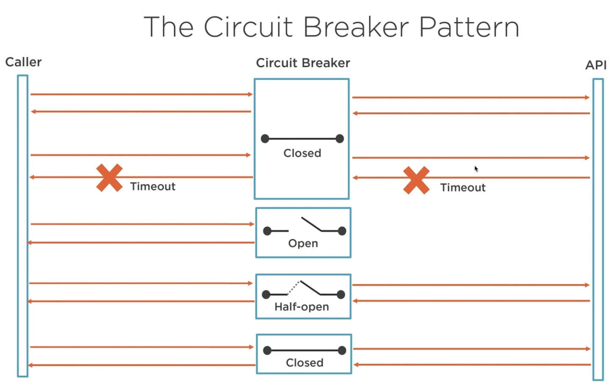
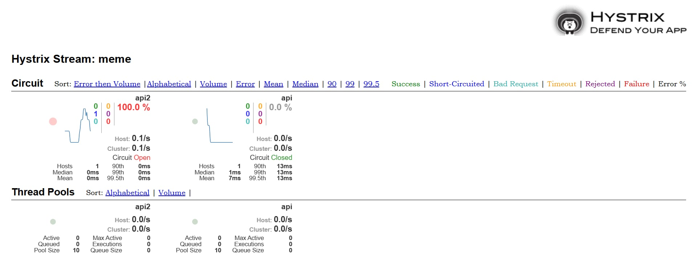

### Go Circuit Breaker Demo with Hystrix

This is a Go project using **Fiber** and **Hystrix-Go** to demonstrate the **Circuit Breaker pattern** when calling a 3rd party API.

---

### Circuit Breaker Pattern

This example uses the **Circuit Breaker** pattern as illustrated



---

### Dashboard

You can monitor the real-time status using the **Hystrix Dashboard**



---

### Features

- **Client**:
  - `/api` and `/api2` → Call the 3rd party API via a Hystrix circuit breaker.
  - **Fallback** is implemented when the API is unresponsive.
  - The Hystrix Stream runs on `http://localhost:8002/hystrix.stream`.
- **Server**:
  - `/api` → The simulated 3rd party API.
  - A delay is simulated between the 5th and 10th requests to test the circuit breaker.

---

### Run Locally

1.  **Run Server**

    ```sh
    cd server
    go run main.go
    ```

    - The server will run on port **8000**.
    - Endpoint: `http://localhost:8000/api`

2.  **Run Hystrix Dashboard with Docker Compose**

    ```sh
    docker-compose up -d
    ```

    - The Hystrix Dashboard will be accessible at `http://localhost:9002/`.

3.  **Run Client**
    ```sh
    cd client
    go mod tidy
    go run main.go
    ```
    - The client will run on port **8001**.
    - Endpoints:
      `http://localhost:8001/api`
      `http://localhost:8001/api2`
    - Hystrix Stream:
      `http://localhost:8002/hystrix.stream`

---

### Test the Circuit Breaker

1.  **Call the client endpoints**:

    ```sh
    curl http://localhost:8001/api
    curl http://localhost:8001/api2
    ```

2.  After the 5th to 10th requests, the server will **simulate a delay**, triggering the **circuit breaker** to activate the fallback.

3.  If you have the Hystrix Dashboard running with Docker, you can **monitor it in real-time**
    - Dashboard UI: `http://localhost:9002/`
    - Stream URL: `http://localhost:8002/hystrix.stream`

---

### Notes

- The client's `/api` and `/api2` endpoints both use **Hystrix-Go** to call the same `/api` endpoint on the server.
- This project is for practicing the **circuit breaker pattern**, fallback mechanisms, and Hystrix streams.

---
